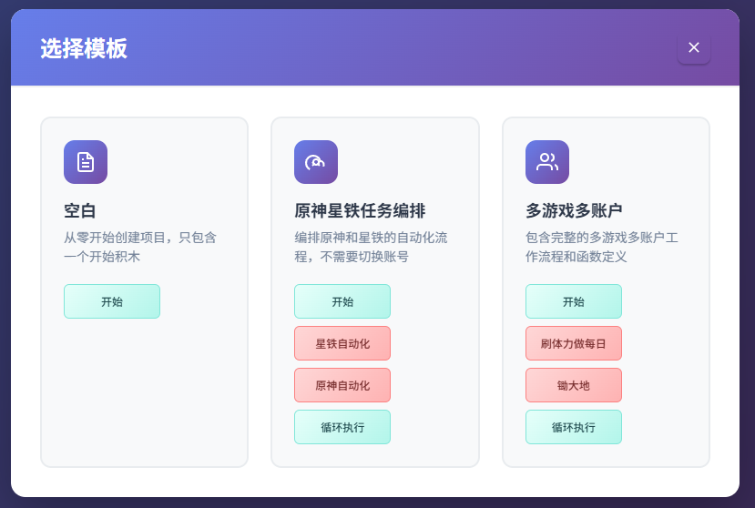
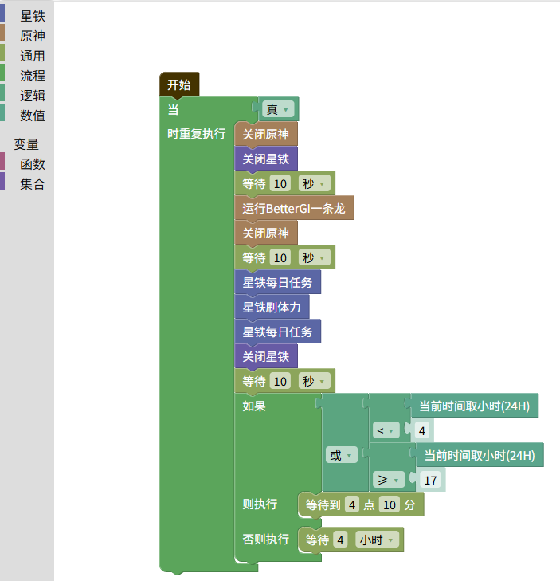
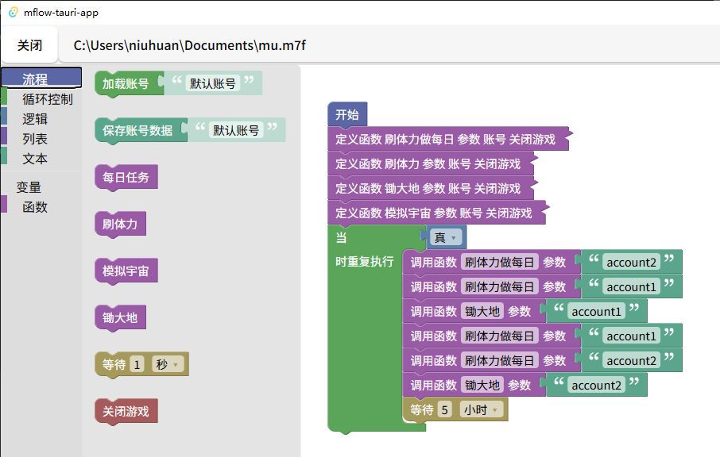

# 三月七小助手工作流

三月七小助手、更好的原神、绝区零一条龙工作流编排工具。主要解决多账号多游戏任务编排问题。支持 原神、崩坏 - 星穹铁道 、绝区零。


#### 相关项目

- [三月七小助手(March7thAssistant)](https://github.com/moesnow/March7thAssistant)
- [更好的原神(BetterGI)](https://github.com/babalae/better-genshin-impact)
- [绝区零一条龙(ZenlessZoneZero-OneDragon)](https://github.com/OneDragon-Anything/ZenlessZoneZero-OneDragon)

## 教程

1. 下载 三月七小助手完整版、更好的原神、绝区零一条龙完整带运行时版。 安装 [powershell](https://github.com/powershell/powershell/releases) 7.5以上。
2. 对三方程序进行配置
   - 三月七小助手
     - 设置成任务结束时关闭程序和游戏。
     - 将模拟宇宙次数设置成禁用每天1次难度4（或更低）。根据自己需求选择模拟宇宙或者差分宇宙，超时设置为1小时。并且在菜单中选择原版运行，将里面的设置也更改成1次保存。
     - 运行一次以下载ocr、锄大地、模拟宇宙等插件。
     - 将锄大地任务设置成5小时超时。
   - 更好的原神, 将一条龙设置成结束后关闭游戏和程序，调度器中增加一个`退出程序`配置组，增加shell 关闭更好的原神  `taskkill /f /im BetterGI.exe` 。
   - 绝区零一条龙设置关闭自动更新。
   - 将以上程序分别运行一次，确保无误。
3. 开启程序后设置三月七小助手文件夹路径，更好的原神安装文件夹路径, 绝区零一条龙安装后的文件夹路径。
4. （可选）多账户时，需要导出账户。
   - 导出星铁账户： 完全进入游戏后设置接续自动战斗，关闭游戏。清除注册表登录其他账户，再次重复操作，再次导出。
5. 使用多游戏或多账户模板新建一个工程，调配好账户名称和积木，点击运行。

## 注意事项

1. 多账号：导出导入账号时会同时备份和恢复三月七小助手、更好的原神、绝区零一条龙的配置文件。请导入修改之后、之后再导出一次。
2. 若使用 `更好的原神调度器`, 请使用空格分隔多个配置组, 在最后增加“退出程序”, 请保持最后运行。（目前使用程序是否存在判断任务是否执行完， 否则会等待5小时超时）
3. 测试分差宇宙会有时会无限循环， 找不到路就退出重新开始游戏，导致一直到超时，推荐用模拟宇宙。

## 截图







## 开发

### 环境

- node 22 , yarn
- rust 1.85.0-nightly (14ee63a3c 2024-12-29)
- [三月七小助手FULL](https://github.com/moesnow/March7thAssistant)
- [更好的原神](https://bettergi.com/download.html)
- [绝区零一条龙](https://github.com/OneDragon-Anything/ZenlessZoneZero-OneDragon/releases)

### 开发环境启动

```
yarn cmd
```

### 其他

启动并自动运行脚本

```
mflow-tauri-app.exe --auto-run main.m7f
# 或
yarn cmd --auto-run ../test.m7f  
```